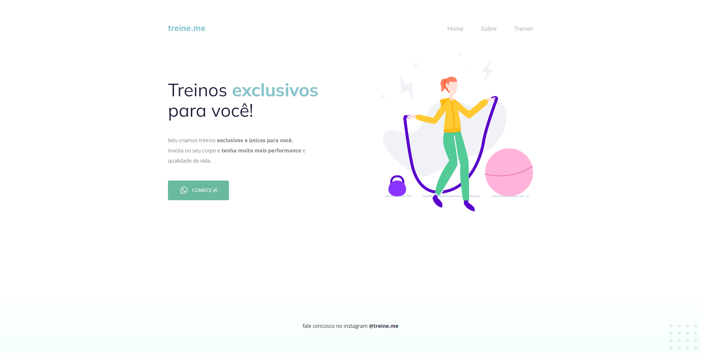

  

## 🖥️ Projeto
Esse  é um projeto inicial (ilustrativo) de um site.

## 🚀 Tecnologias
Esse projeto  foi desenvolvido durante o Curso - Explorer da Rocketseat com as seguintes tecnologias:

- HTML
- CSS
- Git e Github

## 🏷️ Layout
Você pode visualizar o layout do projeto através
[desse link](https://www.figma.com/file/nyiUUJVcwxz3rvSf6HQG6E/Explorer---Projeto-02-(Copy)?type=design&node-id=0-1&t=ECeH5awxnbjlzBFX-0).
É necessário ter uma conta no [Figma](https://www.figma.com)